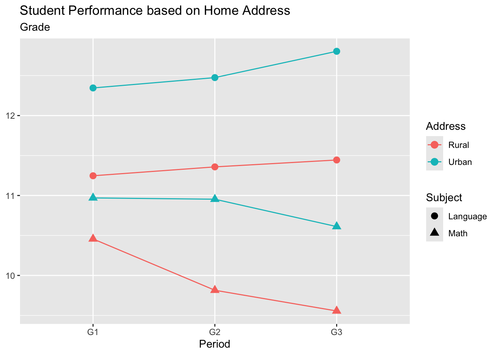

```{r}
#| label: packages

library(tidyverse)
library(knitr)
library(broom)
```

[Download .qmd starter file](project.qmd)

[Download student-por.csv](data/student-por.csv)

[Download student-mat.csv](data/student-mat.csv)

## Data Overview

The [data](https://archive.ics.uci.edu/dataset/320/student+performance) for this
lab is provided by UC Irvine's Machine Learning Repository. This data involves
student achievement in secondary education at two Portuguese schools. The collected
data includes student demographic information, study habits, and extracurricular
activities. There are two datasets that outline performance in two different
subjects: math and Portuguese language.

::: {.callout-caution collapse="true"}
## Click here for detailed data description

Outline of each variable, as provided by UCI's Machine Learning Repository.

#### Attributes for both math and language datasets

1. **school** - student's school (binary)
   - GP: Gabriel Pereira
   - MS: Mousinho da Silveira

2. **sex** - student's sex (binary)
   - F: female
   - M: male

3. **age** - student's age (numeric)
   - From 15 to 22

4. **address** - student's home address type (binary)
   - U: urban
   - R: rural

5. **famsize** - family size (binary)
   - LE3: less or equal to 3
   - GT3: greater than 3

6. **Pstatus** - parent's cohabitation status (binary)
   - T: living together
   - A: apart

7. **Medu** - mother's education (numeric)
   - 0: none
   - 1: primary education (4th grade)
   - 2: 5th to 9th grade
   - 3: secondary education
   - 4: higher education

8. **Fedu** - father's education (numeric)
   - 0: none
   - 1: primary education (4th grade)
   - 2: 5th to 9th grade
   - 3: secondary education
   - 4: higher education

9. **Mjob** - mother's job (nominal)
   - teacher
   - health care related
   - services (e.g. administrative or police)
   - at_home
   - other

10. **Fjob** - father's job (nominal)
    - teacher
    - health care related
    - services (e.g. administrative or police)
    - at_home
    - other

11. **reason** - reason to choose this school (nominal)
    - home: close to home
    - reputation: school reputation
    - course: course preference
    - other

12. **guardian** - student's guardian (nominal)
    - mother
    - father
    - other

13. **traveltime** - home to school travel time (numeric)
    - 1: <15 min.
    - 2: 15 to 30 min.
    - 3: 30 min. to 1 hour
    - 4: >1 hour

14. **studytime** - weekly study time (numeric)
    - 1: <2 hours
    - 2: 2 to 5 hours
    - 3: 5 to 10 hours
    - 4: >10 hours

15. **failures** - number of past class failures (numeric)
    - n if 1 <= n < 3
    - otherwise 4

16. **schoolsup** - extra educational support (binary)
    - yes
    - no

17. **famsup** - family educational support (binary)
    - yes
    - no

18. **paid** - extra paid classes within the course subject (Math or Portuguese) (binary)
    - yes
    - no

19. **activities** - extra-curricular activities (binary)
    - yes
    - no

20. **nursery** - attended nursery school (binary)
    - yes
    - no

21. **higher** - wants to take higher education (binary)
    - yes
    - no

22. **internet** - Internet access at home (binary)
    - yes
    - no

23. **romantic** - with a romantic relationship (binary)
    - yes
    - no

24. **famrel** - quality of family relationships (numeric)
    - 1: very bad
    - 5: excellent

25. **freetime** - free time after school (numeric)
    - 1: very low
    - 5: very high

26. **goout** - going out with friends (numeric)
    - 1: very low
    - 5: very high

27. **Dalc** - workday alcohol consumption (numeric)
    - 1: very low
    - 5: very high

28. **Walc** - weekend alcohol consumption (numeric)
    - 1: very low
    - 5: very high

29. **health** - current health status (numeric)
    - 1: very bad
    - 5: very good

30. **absences** - number of school absences (numeric)
    - From 0 to 93

#### These grades are related with the course subject, Math or Portuguese

31. **G1** - first period grade (numeric)
    - From 0 to 20

32. **G2** - second period grade (numeric)
    - From 0 to 20

33. **G3** - final grade (numeric, output target)
    - From 0 to 20

#### Additional note

There are several (382) students that belong to both datasets. These student
can be identified by searching for identical attributes that characterize
each student. These features are:

- school
- sex
- age
- address
- famsize
- Pstatus
- Medu
- Fed
- Mjob
- Fjob
- reason
- nursery
- internet
:::

```{r}
# math dataset
math <- read_delim("data/student-mat.csv", delim = ';')
# language dataset
lang <- read_delim("data/student-por.csv", delim = ';')
```

## Data Cleaning

**1.** Clean the datasets as follows: 

- covert `school`, `sex`, `address`, `famsize`, `Pstatus`, `Medu`, `Fedu`, 
`Mjob`, `Fjob`, `reason`, and `guardian` to factors
- could convert anything labeled `yes` to `True` and `no` to `False`
- **TODO: clean this up:** eventually, drop columns that we don't need 

```{r}
# Your solution for math here.
```

```{r}
#| code-fold: true
#| code-summary: "Click here to see the solution"
math <- math |>
  mutate(across(school:traveltime, as.factor)) |>
  mutate(across(schoolsup:romantic, 
                ~ case_when(.x == "yes" ~ TRUE, 
                            .x == "no"  ~ FALSE, 
                            .default    = NA)))
```
  
```{r}
# Your solution for lang here.
```  

```{r}
#| code-fold: true
#| code-summary: "Click here to see the solution"
lang <- lang |>
  mutate(across(school:traveltime, as.factor)) |>
  mutate(across(schoolsup:romantic, 
                ~ case_when(.x == "yes" ~ TRUE, 
                            .x == "no"  ~ FALSE, 
                            .default    = NA)))
```

## Combine Datasets

As noted in the data description, 382 students appear in both the math and
language datasets. We can combine math and language performance based
on unique student attributes.

**2a.** Using the shared attributes listed in the data description, join the `math`
and `lang` datasets so that each row represents one student enrolled in both
courses. Assign this to a new dataset called `both_classes`.

::: callout-tip

Think carefully about which type of join is appropriate here. Should
you keep all students, or only those who appear in both datasets?

There are going to be repeated columns across the two datasets. How can you
handle these? We recommend naming the columns for math and language performance
`G3_math` and `G3_lang`, respectively.

:::

```{r}
# code for Q2a
```

```{r}
#| code-fold: true
#| code-summary: "Click here to see the solution"
both_classes <- math |> 
  inner_join(lang,
             by = c("school", "sex", "age", "address", "famsize", "Pstatus", 
                    "Medu", "Fedu", "Mjob", "Fjob", "reason", "nursery", 
                    "internet"),
             suffix = c("_math", "_lang"))
```
:::{.callout-tip}

## Checkpoint
Your joined dataset should have 382 rows.

:::

**2b.** Take a look at your joined dataset. You may notice that soem students
have a final grade (`G3_math` or `G3_lang`) of 0. These students did not 
actually score a zero, they withdrew from the course before the final exam.
Filter these students out of `both_classes` so they do not skew your analysis.
How many students remain after filtering?

```{r}
# code for Q2b
```

```{r}
#| code-fold: true
#| code-summary: "Click here to see the solution"

both_classes <- both_classes |> 
  filter(G3_math != 0, G3_lang != 0)

nrow(both_classes)
```

There are 340 students remaining after filtering.

**3.** Using `both_classes`, create a new variable `g3_diff` that represents
the difference between a student's final math grade (`G3_math`) and their final 
Portuguese language grade (`G3_lang`). Which subject did students tend to 
perform better in on average? Answer in one sentence below your code.

```{r}
# code for Q3
```

```{r}
#| code-fold: true
#| code-summary: "Click here to see the solution"

both_classes <- both_classes |> 
  mutate(g3_diff = G3_math - G3_lang)

both_classes |> 
  summarize(mean_math = mean(G3_math),
            mean_lang = mean(G3_lang),
            mean_diff = mean(g3_diff))
```

Students tend to perform better in language than in math class, given that the 
mean scoring for language is 12.81 and the mean scoring for math is 11.6.

## The Effect of Region on Performance

**4.** Write a function called `compare_subjects` that takes a dataframe, a 
demographic variable, and a list of performance variables. The function should
return a table that shows the mean of each performance variable, grouped
by the demographic variable.

```{r}
# Your solution here.
```

```{r}
#| code-fold: true
#| code-summary: "Click here to see the solution"


compare_subjects <- function(df, demographic, cols) {
  df |>
    group_by({{ demographic }}) |>
    summarize(across({{ cols }}, mean, .names = "mean_{.col}"))
}

```

Make sure the function works by running the following code: 

```{r}
address_performance <- compare_subjects(both_classes,
                                        address, 
                                        c(G1_math, G1_lang, G2_math,
                                          G2_lang, G3_math, G3_lang))
```

**5.**
Now, use `address_performance` to create a graph that shows the difference in
performance between Rural and Urban students. This graph should show how both
math and language performance changed throughout the year. Here is an image of
what the graph should look like: 



::: callout-tip

Think about pivoting the data. 

:::

```{r}
# Your solution here.
```

```{r}
#| code-fold: true
#| code-summary: "Click here to see the solution"

# reference for interaction:
# google search: "ggplot create lines based on two variables grouped together"
# website with example: https://physiology.med.cornell.edu/people/banfelder/qbio/lecture_notes/intro2ggplot.html

graph <- address_performance |>
  pivot_longer(
    cols = -address,
    names_to = c("grade", "subject"),
    names_pattern = "mean_(G\\d)_(math|lang)"
  ) |>
  mutate(address = if_else(address == "R",
                           "Rural",
                           "Urban"),
        subject = if_else(subject == "math",
                           "Math",
                           "Language")) |>
  ggplot(aes(x = grade,
             y = value,
             color = address,
             shape = subject,
             group = interaction(address, subject))) +
  geom_line() +
  geom_point(size = 3) + 
  labs(title = "Student Performance based on Home Address",
       subtitle = "Grade",
       x = "Period", 
       y = NULL, 
       color = "Address",
       shape = "Subject")
```

## What Affects Math Performance?

**6.** Create a histogram displaying the distribution of the final math grades
(`G3.x`) for students in `both_classes`. Based on the shape of the distribution,
does the data appear to be approximately normally distributed? Ansewr in one to 
two sentences below your code.

::: callout-tip

Think about appropriate bin widths, singe grades range from 0 to 20,
a bin width of 1 makes sense here!

:::

```{r}
# Your solution here.
```

```{r}
#| code-fold: true
#| code-summary: "Click here to see solution"
both_classes |> 
  ggplot(aes(x = G3_math)) +
  geom_histogram(binwidth = 1,
                  fill = "steelblue",
                  color = "white") +
  labs(
    title = "Distribution of Final Math Grades",
    x = "Final Math Grade (0-20)",
    y = "Number of Students"
  )
```

**7.** Create a scatterplot regressing G3 on goout from the math dataset.
Create another scatterplot regressing G3 on studytime from the math dataset.
Create a summary table for both, and then explain why one model is better than
the other model.

```{r}
#Your solution for G3 ~ goout here
```

```{r}
#| code-fold: true
#| code-summary: "Click here to see solution"
math |>
  ggplot(aes(x = goout, y = G3)) +
  geom_point(alpha = .8) +
  geom_smooth(method = "lm") +
  xlab("Frequency of Going Out With Friends") +
  ylab("Final Grade")

math_lm <- lm(G3 ~ goout, 
                 data = math)

summary(math_lm)
```

```{r}
#Your solution for G3 ~ studytime here
```

```{r}
#| code-fold: true
#| code-summary: "Click here to see solution"
math |>
  ggplot(aes(x = studytime, y = G3)) +
  geom_point(alpha = .8) +
  geom_smooth(method = "lm") +
  xlab("Time Spent Studying") +
  ylab("Final Grade")

math_lm2 <- lm(G3 ~ studytime, 
                 data = math)

summary(math_lm2)
```

**8.** Create other diagnostic outputs for both models, and use them and the scatterplots you made in Q7 to assess whether the 4 diagnostic conditions are met.

```{r}
#normality check for G3 ~ goout
resid_sd <- sd(math_lm$residuals)
  
math_lm |> 
  broom::augment() |> 
  ggplot(aes(x = .resid)) +
  geom_histogram(aes(y = after_stat(density)), binwidth = 1) +
  stat_function(fun = ~ dnorm(.x, mean = 0, sd = resid_sd),
                color = "steelblue", lwd = 1.5) +
  xlab("Residuals") +
  theme(aspect.ratio = 1)

#normality check for G3 ~ studytime
resid_sd <- sd(math_lm2$residuals)
  
math_lm2 |> 
  broom::augment() |> 
  ggplot(aes(x = .resid)) +
  geom_histogram(aes(y = after_stat(density)), binwidth = 1) +
  stat_function(fun = ~ dnorm(.x, mean = 0, sd = resid_sd),
                color = "steelblue", lwd = 1.5) +
  xlab("Residuals") +
  theme(aspect.ratio = 1)
```

```{r}
#equal variance check for G3 ~ goout
math_lm |> 
  augment() |> 
  ggplot(aes(x = .fitted, y = .resid)) +
  geom_point() +
  geom_hline(yintercept = 0, linetype = "dashed", 
             color = "red", lwd = 1.5)

#equal variance check for G3 ~ studytime
math_lm2 |> 
  augment() |> 
  ggplot(aes(x = .fitted, y = .resid)) +
  geom_point() +
  geom_hline(yintercept = 0, linetype = "dashed", 
             color = "red", lwd = 1.5)
```

From the scatterplots in Q7, we observe that both models meet the linearity condition. From the normality curves, we can see that both models have issues with normality since there are extreme outliers and very choppy histograms. Both models have equal variance based on the fitted vs residuals plot as can be seen by the dashed line being on 0.

**9.** In Q7, you explored how `goout` and `studytime` each individually predict
final math grades. Now, fit a multiple regression model that predicts `G3` using
`studytime`, `failures`, `absences`, and `Medu` from the `math` dataset. Answer
the following questions below your code:
   - Which predictors are statistically significant at the 0.05 level?
   - Interpret the coefficient for `studytime` in context?
   - Does this model explain more variance in `G3` than the simple models from 
   Q7? Compare the adjusted R-squared values.
   
```{r}
# Your solution here
```

```{r}
#| code-fold: true
#| code-summary: "Click here to see the solution"

math_multi <- lm(G3 ~ studytime + failures + absences + Medu, data = math)
summary(math_multi)

tibble(
  model     = c("Simple (studytime only)", "Multiple Regression"),
  adj_r_squared = c(glance(math_lm2)$adj.r.squared, 
                    glance(math_multi)$adj.r.squared)
) |>
  kable(col.names = c("Model", "Adjusted R-Squared"),
        digits = 4)
```

   - Which predictors are statistically significant at the 0.05 level?
`failures` is the only predictor that is statistically significant at the 0.05 level (p < 0.001). `studytime` and `absences` are not significant, and `Medu` is only slightly significant at the 0.1 level.
   
   - Interpret the coefficient for `studytime` in context?
The coefficient for `studytime` is 0.201, meaning that for each one-unit increase in study time category, a student's final math grade is predicted to increase by about 0.2 points, holding all other variables constant. However, this effect is not statistically significant. 

   - Does this model explain more variance in `G3` than the simple models from 
   Q7? Compare the adjusted R-squared values.
Yes, the multiple regression model explains more variance as its adjusted R-squared is 0.149 compared to the 0.007 for the simple `G3 ~ studytime` model. This means that adding `failures`, `absences`, and `Medu` significantly improves the model's explanatory power.

**10.** Before we can evaluate how well our model generalizes, we need to
understand the ideaof a train/test split. Using the `math` dataset, perform the 
following steps:
   - Randomly split the data into a training set (80%) and a testing set (20%).
     Use `set.seed(331)` so your results are reproducible.
   - Fit the same multiple regression model from Q9 (`G3 ~ studytime + failures
     + absences + Medu`) on the TRAINING data only.
   - Generate predictions for the TESTING data and calculate the R-squared on
     both training and testing sets.
     
Based on your results, does the model appear to be overfitting, underfitting,
or neither?

::: callout-tip
**Hint:** You will need a helper function to calculate R-squared. Recall that
R-squared = 1 - SSE/SST.
:::
   
```{r}
# Your solution here
```

```{r}
#| code-fold: true
#| code-summary: "Click here to see the solution"

r2_calc <- function(obs, pred) {
  sse <- sum((obs - pred)^2, na.rm = TRUE)
  sst <- sum((obs - mean(obs, na.rm = TRUE))^2, na.rm = TRUE)
  1 - sse/sst
}

set.seed(331)
n <- nrow(math)
train_idx <- sample(1:n, size = floor(0.8 * n))

train <- math[train_idx, ]
test  <- math[-train_idx, ]

fit <- lm(G3 ~ studytime + failures + absences + Medu, data = train)

tibble(
  split    = c("Training", "Testing"),
  r_squared = c(r2_calc(obs = train$G3, pred = predict(fit, newdata = train)),
                r2_calc(obs = test$G3,  pred = predict(fit, newdata = test)))
) |>
  kable()
```

The training R-squared is approximately 0.163 and the testing R-squared is 
approximately 0.149. Since the testing R-squared is slightly lower than the 
training R-squared, the model appears to be very slightly overfitting. 
However, the difference is small enough that the model is essentially neither
overfitting nor underfitting in any meaningful way.

**11.** The problem with a single train/test split is that the result depends 
heavily on which observations happened to end up in each set. K-fold cross 
validation solves this by iterating over multiple splits and averaging the 
results. Write a function called `cv_r2` that takes a dataframe, a model
formula, and a number of folds `k`, and returns a vector of R-squared values 
(one per fold). Then call your function on the `math` dataset using the same 
model from Q9 and compare the mean cross-validated R-squared to your training 
and testing R-squared from Q10. What does this tell you about the stability of 
the model?

::: callout-tip
**Hint:** You already wrote `r2_calc` in Q10, you can reuse it here!
:::

```{r}
# Your solution here
```

```{r}
#| code-fold: true
#| code-summary: "Click here to see the solution"

cv_r2 <- function(df, formula, k = 5) {
  if (!is.data.frame(df)) stop("Input must be a data frame.")
  
  set.seed(331)
  n <- nrow(df)
  df <- df |>
    mutate(fold = sample(rep_len(1:k, length.out = n), size = n))
  
  results <- rep(NA, k)
  
  for (i in 1:k) {
    train <- df |> filter(fold != i)
    test  <- df |> filter(fold == i)
    
    fit   <- lm(formula, data = train)
    preds <- predict(fit, newdata = test)
    
    results[i] <- r2_calc(obs = test[[as.character(formula[[2]])]],
                           pred = preds)
  }
  
  results
}

fold_r2 <- cv_r2(math, G3 ~ studytime + failures + absences + Medu)

tibble(
  fold      = 1:5,
  r_squared = fold_r2
) |>
  bind_rows(tibble(fold = NA, r_squared = mean(fold_r2))) |>
  mutate(fold = as.character(fold),
         fold = if_else(is.na(fold), "Mean", fold)) |>
  kable(col.names = c("Fold", "R-Squared"))
```

The mean cross-validated R-squared is approximately 0.135, which is very close to
both the training and testing R-squared values from Q10. This consistency across
all 5 folds suggests that the model is stable and generalizes reasonably well
to new data. The fact that the CV R-squared values vary somewhat across folds
(some higher, some lower) illustrates exactly why a single train/test split
can be misleading. This is because the result depends heavily on which 
observations end up in which set. The k-fold approach gives a more reliable
estimate of true model performance.
