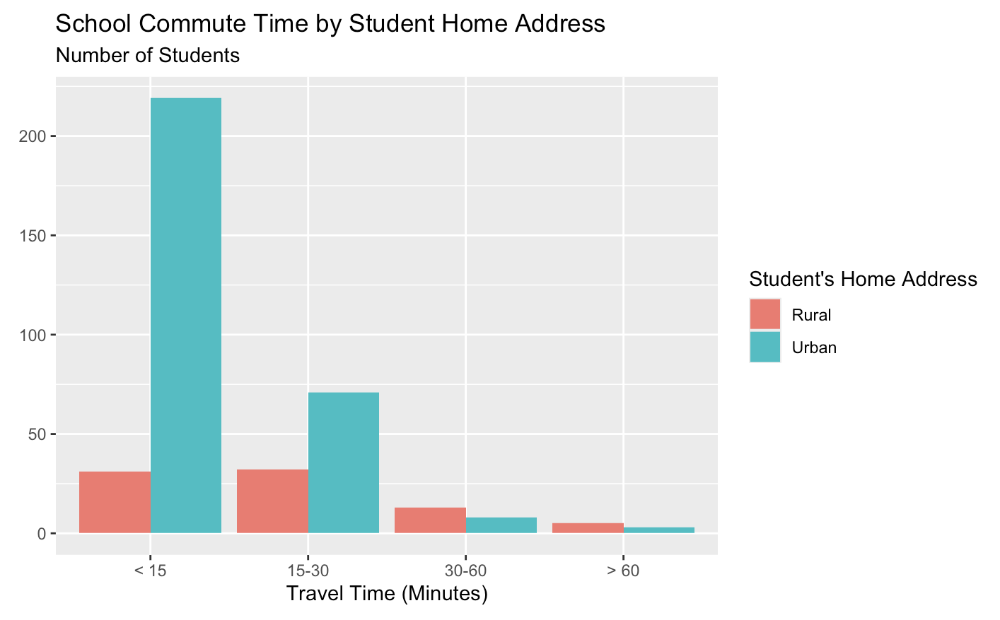

```{r}
#| label: packages

library(tidyverse)
library(knitr)
```

## Instructions

The [data](https://archive.ics.uci.edu/dataset/320/student+performance) for this
lab is provided by UC Irvine's Machine Learning Repository. This data involves
student achievement in secondary education at two Portuguese schools. The collected
data includes student demographic information, study habits, and extracurricular
activities. There are two datasets that outline performance in two different
subjects: math and Portuguese language.

::: {.callout-caution collapse="true"}
## Click here for detailed data description

Outline of each variable, as provided by UCI's Machine Learning Repository.

#### Attributes for both math and language datasets

1. **school** - student's school (binary)
   - GP: Gabriel Pereira
   - MS: Mousinho da Silveira

2. **sex** - student's sex (binary)
   - F: female
   - M: male

3. **age** - student's age (numeric)
   - From 15 to 22

4. **address** - student's home address type (binary)
   - U: urban
   - R: rural

5. **famsize** - family size (binary)
   - LE3: less or equal to 3
   - GT3: greater than 3

6. **Pstatus** - parent's cohabitation status (binary)
   - T: living together
   - A: apart

7. **Medu** - mother's education (numeric)
   - 0: none
   - 1: primary education (4th grade)
   - 2: 5th to 9th grade
   - 3: secondary education
   - 4: higher education

8. **Fedu** - father's education (numeric)
   - 0: none
   - 1: primary education (4th grade)
   - 2: 5th to 9th grade
   - 3: secondary education
   - 4: higher education

9. **Mjob** - mother's job (nominal)
   - teacher
   - health care related
   - services (e.g. administrative or police)
   - at_home
   - other

10. **Fjob** - father's job (nominal)
    - teacher
    - health care related
    - services (e.g. administrative or police)
    - at_home
    - other

11. **reason** - reason to choose this school (nominal)
    - home: close to home
    - reputation: school reputation
    - course: course preference
    - other

12. **guardian** - student's guardian (nominal)
    - mother
    - father
    - other

13. **traveltime** - home to school travel time (numeric)
    - 1: <15 min.
    - 2: 15 to 30 min.
    - 3: 30 min. to 1 hour
    - 4: >1 hour

14. **studytime** - weekly study time (numeric)
    - 1: <2 hours
    - 2: 2 to 5 hours
    - 3: 5 to 10 hours
    - 4: >10 hours

15. **failures** - number of past class failures (numeric)
    - n if 1 <= n < 3
    - otherwise 4

16. **schoolsup** - extra educational support (binary)
    - yes
    - no

17. **famsup** - family educational support (binary)
    - yes
    - no

18. **paid** - extra paid classes within the course subject (Math or Portuguese) (binary)
    - yes
    - no

19. **activities** - extra-curricular activities (binary)
    - yes
    - no

20. **nursery** - attended nursery school (binary)
    - yes
    - no

21. **higher** - wants to take higher education (binary)
    - yes
    - no

22. **internet** - Internet access at home (binary)
    - yes
    - no

23. **romantic** - with a romantic relationship (binary)
    - yes
    - no

24. **famrel** - quality of family relationships (numeric)
    - 1: very bad
    - 5: excellent

25. **freetime** - free time after school (numeric)
    - 1: very low
    - 5: very high

26. **goout** - going out with friends (numeric)
    - 1: very low
    - 5: very high

27. **Dalc** - workday alcohol consumption (numeric)
    - 1: very low
    - 5: very high

28. **Walc** - weekend alcohol consumption (numeric)
    - 1: very low
    - 5: very high

29. **health** - current health status (numeric)
    - 1: very bad
    - 5: very good

30. **absences** - number of school absences (numeric)
    - From 0 to 93

#### These grades are related with the course subject, Math or Portuguese

31. **G1** - first period grade (numeric)
    - From 0 to 20

32. **G2** - second period grade (numeric)
    - From 0 to 20

33. **G3** - final grade (numeric, output target)
    - From 0 to 20

#### Additional note

There are several (382) students that belong to both datasets. These student
can be identified by searching for identical attributes that characterize
each student. These features are:

- school
- sex
- age
- address
- famsize
- Pstatus
- Medu
- Fed
- Mjob
- Fjob
- reason
- nursery
- internet
:::

## Access the Data

```{r}
# math dataset
math <- read_delim("data/student-mat.csv", delim = ';')
# language dataset
lang <- read_delim("data/student-por.csv", delim = ';')
```
## Data Cleaning

### Basic Cleaning

- covert school, sex, address, famsize, Pstatus, Medu, Fedu, Mjob, Fjob, reason,
and guardian to factors
- could convert anything labeled "yes"/"no" to True or False
- eventually, drop columns that we don't need (but we wont know which ones until
we are done writing the lab, so will have to do this after lab created)

**1.** How could you write code to clean both datasets as outlined above? (drop columns not included yet as noted)

```{r}
# Your solution for math here.
```

```{r}
#| code-fold: true
#| code-summary: "Click here to see the solution"
math <- math |>
  mutate(across(school:traveltime, as.factor)) |>
  mutate(across(schoolsup:romantic, 
                ~ case_when(.x == "yes" ~ TRUE, 
                            .x == "no"  ~ FALSE, 
                            .default    = NA)))
```
  
```{r}
# Your solution for lang here.
```  

```{r}
#| code-fold: true
#| code-summary: "Click here to see the solution"
lang <- lang |>
  mutate(across(school:traveltime, as.factor)) |>
  mutate(across(schoolsup:romantic, 
                ~ case_when(.x == "yes" ~ TRUE, 
                            .x == "no"  ~ FALSE, 
                            .default    = NA)))
```

### Join the Datasets

As noted in the data description, 382 students appear in both the math and
language datasets. We can identify these students using the attributes they
share across both datasets.

**2.** Using the shared attributes listed in the data description, join the `math`
and `lang` datasets so that each row represents one student enrolled in both
courses. Assign this to a new dataset called `both_classes`.

> **Tip:** Think carefully about which type of join is appropriate here - should
you keep all students, or only those who appear in both datasets?

```{r}
# code for Q2
```

```{r}
#| code-fold: true
#| code-summary: "Click here to see the solution"
both_classes <- math |> 
  inner_join(lang,
             by = c("school", "sex", "age", "address", "famsize", "Pstatus", 
                    "Medu", "Fedu", "Mjob", "Fjob", "reason", "nursery", 
                    "internet"))
```

**Checkpoint:** Your joined dataset should have 382 rows.

```{r}
# both_classes
```

**3.** Using `both_classes`, create a new variable `g3_diff` that represents
the difference between a student's final math grade (`G3.x`) and their final 
Portuguese language grade (`G3.y`). Which subject did students tend to perform 
better in on average? Answer in one sentence below your code.**

```{r}
# code for Q3
```

```{r}
#| code-fold: true
#| code-summary: "Click here to see the solution"
both_classes <- both_classes |> 
  mutate(g3_diff = G3.x - G3.y)

both_classes |> 
  summarize(mean_diff = mean(g3_diff))
```

## Inference or Something

**4a.** Write a function that will, given a dataframe, group by one column
and count another column. That is, the output should be a dataframe with three
columns: the group by variable, the counted variable, and the counts. Implement
reasonable input validation. Call this function `group_and_summarize`.


`group_and_summarize` should take in four parameters: 


- dataframe
- column to group by
- column to summarize
- an *optional* name for the new column or something like that ...

```{r}
# Your solution here.
```

```{r}
#| code-fold: true
#| code-summary: "Click here to see the solution"
group_and_summarize <- function(df, group_col, summary_col, col_name = "new_col") {
  if (!is.data.frame(df)) {
    stop("Error: Input must be a data frame.")
  }
  
  df |>
    count({{ group_col }}, {{ summary_col }}) |>
    rename(count = n)
}
```


**4b.** Apply this function to `both_classes` to prove that it works. Group by
`address`and count `traveltime`. Name your ouptut `addr_traveltime`.

       
```{r}
addr_traveltime <- group_and_summarize(both_classes, address, traveltime.x)
addr_traveltime |>
  kable()
```

**5.** Now, create a graph with `addr_traveltime`. This graph should contain 
side-by-side bar charts for students from "Rural" and "Urban" environments.
Here is an image for reference: 



::: callout-tip

Make sure to convert the travel times from their factor/groupings/whatever to 
the actual time in minutes. For reference:

 - Level 1: Less than 15 minutes.
 - Level 2: 15 to 30 minutes.
 - Level 3: 30 minutes to 1 hour.
 - Level 4: More than 1 hour.
 
:::

```{r}
# Your solution here.
```

```{r}
#| code-fold: true
#| code-summary: "Click here to see the solution"

plot <- addr_traveltime |>
  mutate(
    address = case_when(
      address == "R" ~ "Rural",
      .default = "Urban"),
    traveltime.x = case_when(
      traveltime.x == 1 ~ "< 15",
      traveltime.x == 2 ~ "15-30",
      traveltime.x == 3 ~ "30-60",
      .default = "> 60"),
    traveltime.x = fct_relevel(traveltime.x, "< 15", "15-30", "30-60", "> 60")) |>
  ggplot(aes(x = traveltime.x, y = count, fill = address)) + 
  geom_col(position = "dodge") + 
  labs(title = "School Commute Time by Student Home Address",
       subtitle = "Number of Students",
       x = "Travel Time (Minutes)",
       y = NULL,
       fill = "Student's Home Address")

# plot
```


**6.** Create a histogram displaying the distribution of the final math grades
(`G3.x`) for students in `both_classes`. Based on the shape of the distribution,
does the data appear to be approximately normally distributed? Ansewr in one to 
two sentences below your code.

> **Tip:** Think about appropriate bin widths, singe grades range from 0 to 20,
> a bin width of 1 makes sense here!

```{r}
# Your solution here.
```

```{r}
#| code-fold: true
#| code-summary: "Click here to see solution"
both_classes |> 
  ggplot(aes(x = G3.x)) +
  geom_historgram(binwidth = 1,
                  fill = "steelblue",
                  color = "white") +
  labs(
    title = "Distribution of Final Math Grades",
    x = "Final Math Grade (0-20)",
    y = "Number of Students"
  )
```

